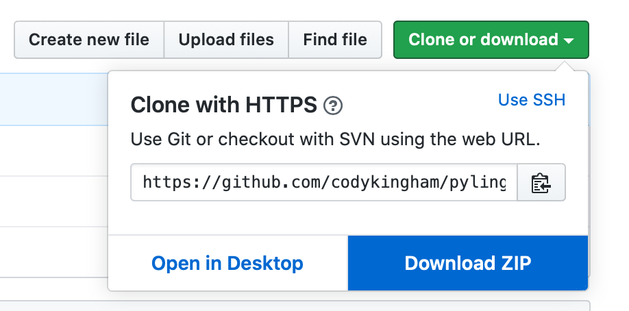
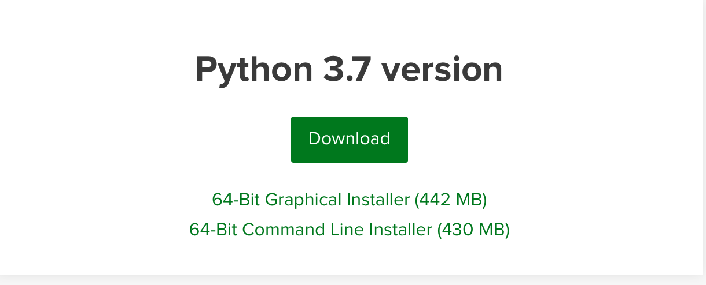
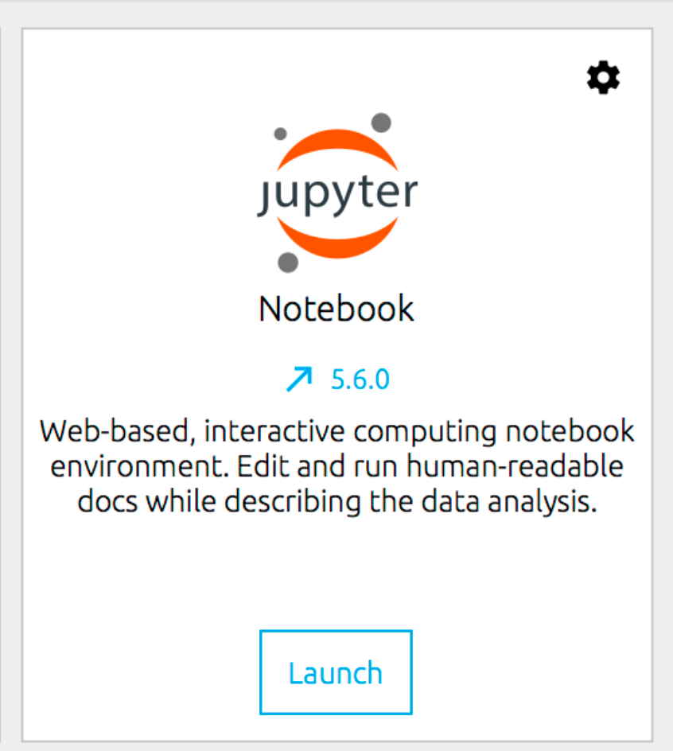
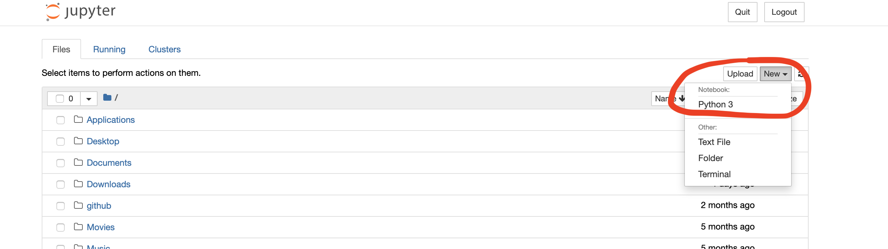

# Python for Linguists and Humanists 

**Cody Kingham, `cak47[put "at-sign" here].cam.ac.uk`**

**NOTE: this course will be updated regularly throughout the next few weeks. -12/04/2020**

Much of this course material is directly adapted from the [Python for Text Analysis Course](https://github.com/cltl/python-for-text-analysis) at the Vrije Universiteit Amsterdam. I take care to indicate those materials which are directly copied from that course. A special thanks to [Chantal van Son](https://github.com/ChantalvanSon), [Evan Miltenburg](https://github.com/evanmiltenburg), [Marten Postma](https://github.com/MartenPostma), [Filip Ilievski](https://github.com/filievski), Pia Sommerauer, and the [Computational Lexicology & Terminology Lab](http://www.cltl.nl) at the VU.

Pandas chapters are from [Joris Van den Bossche's Pandas Tutorial](https://github.com/jorisvandenbossche/pandas-tutorial)

## Contents

* [Intro](#Intro) - description of the course 
* [Course Schedule](#Course-Schedule) - course schedule for Spring 2020
* [Directory (Folder) Structure](#Directory-Structure) - structure of this directory (i.e. folder)
* [Getting Started](#Getting-Started) – [how to download this repository](#Download-Repository); [instructions to install Anaconda](#Install-Anaconda); [Bring Your Own Text (BYOT)](#Bring-Your-Own-Text) for exercises
* [Learning Strategies](#Learning-Strategies) - advice for learning how to code in Python
* [Zen of Python](#Zen-of-Python) – how to write good Python code
* [Bibliography](#Bibliography) - resources used to develop this course

## Intro

Welcome to the Python for Linguists and Humanists course! In this course you will learn the basics of Python and how to begin using Python to address corpus-driven, quantitative research questions in your field. This course puts an emphasis on a **Bring Your Own Text** (BYOT) approach, where many of the assignments work from a plain-text file of a text you are interested in. While there are many existing off-the-shelf tools for English texts, humanists often work with non-English texts that are comparatively resource poor. Many Python courses use dummy problems for the exercises. But I've worked to relate many of the exercises to a worthwhile concept in corpus linguistics. Another distinctive of this course is that [Pandas DataFrames](https://pandas.pydata.org/pandas-docs/stable/getting_started/overview.html) are introduced early on. Pandas is a Python package which provides [data containers](https://docs.python.org/3/library/collections.html) such as [DataFrames](https://pandas.pydata.org/pandas-docs/stable/reference/api/pandas.DataFrame.html#pandas.DataFrame). DataFrames are tables of rows and columns (see [matrices](https://www.khanacademy.org/math/precalculus/x9e81a4f98389efdf:matrices/x9e81a4f98389efdf:mat-intro/a/intro-to-matrices)) that contain numerical or categorical data. This data structure comes standard in R, for instance, due to its necessity for statistics and data science. Knowledge of Pandas DataFrames is likewise critical if you'd like to expand to machine learning later on.

The total duration of this course is 8 weeks. The first 2 weeks focus on the bare basics of Python. In week 3 we dive into Pandas DataFrames. Week 4 focuses on reading and writing various data formats. In week 5, a basic introduction to Matplotlib for data visualizations is provided. Finally, from weeks 6-7 we will review methods and tools for quantitative linguistics. An overview of quantitative linguistic methods is explored via [Natalia Levshina](http://www.natalialevshina.com), [Stefan Gries and Anatol Stefanowitsch](https://www.researchgate.net/publication/37929828_Collostructions_Investigating_the_interaction_of_words_and_constructions), and [Nick Ellis](https://lsa.umich.edu/psych/people/faculty/ncellis.html). We look at off-the-shelf tools such as [Text-Fabric](https://annotation.github.io/text-fabric/), [Natural Language Toolkit](https://www.nltk.org) and [spaCy](https://spacy.io). The 8th and final week will be dedicated to the final project, in which you will formulate a research question/hypothesis, and design a quantitative experiment to test that hypothesis within your own text. As the culmination of that experiment, you will upload your work to Github and archive it in [Zenodo](https://zenodo.org). 

## Course Schedule

**27 March – 15 May (2020)**

## Chapters 

Cody will teach the chapters. Held via Zoom (see Slack for more info).

| Date | Time | Chapters | Topics | Assignment |
| ---- | -----| -------- | ------ | -----------|
| 27.03.2020 | 14:00–15:00 UTC | intro, [1–3](chapters) | Jupyter Notebook, variables, values, integers, floats | set-up & review chs 1–3 |
| 03.04.2020 | 14:00–15:00 UTC | [4-5](chapters) | strings, booleans, conditionals | [ASSIGNMENT_1.ipynb](assignments/ASSIGNMENT_1.ipynb) |
| 10.04.2020 | 14:00–15:00 UTC | [6-12](chapters) | containers, loops, functions  | [ASSIGNMENT_2.ipynb](assignments/ASSIGNMENT_2.ipynb) |
| 17.04.2020 | 14:00–15:00 UTC | [13-17](chapters) | Pandas DataFrames | notebook exercises | 
| 24.04.2020 | 14:00–15:00 UTC | [18](chapters) |  importing, read/write, csv | catch-up week | 
| 01.05.2020 | 14:00–15:00 UTC | TBD | methods in quantitative linguistics | TBD |
| 08.05.2020 | 14:00–15:00 UTC | TBD | Text-Fabric, Natural Language Toolkit, spaCy | TBD | 
| 15.05.2020 | 14:00–15:00 UTC | project | submit final project |  |  

## Working Sessions

Relaxed working session where students can ask questions and get help on assignments. Held via Zoom (see Slack for more info).

| Date | Time | 
| ---- | ---- | 
| 01.04.2020 | 14:00–15:30 UTC | 
| 08.04.2020 | 14:00–15:30 UTC | 
| 15.04.2020 | 14:00–15:30 UTC | 
| 22.04.2020 | 14:00–15:30 UTC | 
| 29.04.2020 | 14:00–15:30 UTC | 
| 06.05.2020 | 14:00–15:30 UTC | 
| 13.05.2020 | 14:00–15:30 UTC | 

## Directory Structure

A directory is another word for a "folder". This director contains the following "sub"-directories. They are explained below in order of importance.

1. [chapters](chapters) – contains the Jupyter notebooks from which I'll teach each lesson
2. [assignments](assignments) - contains the Jupter notebook assignments which you can submit for optional evaluation
3. [BYOT](BYOT) – put the `.txt` file you want to use for the assignments here
4. [data/texts](data/texts) – ready-made `.txt` files to put in BYOT if you don't want to use your own
5. [data](data) - data for the various assignments will go here
6. [images](images) – these are just images for displaying content throughout the directory 

## Getting Started

### Download Repository

The page you're reading now is a part of what's called a Github repository. A "repository" is just another way of saying "folder" or project. Github gives us a way to store and share code openly online. 

You will need a copy of this repository on your own machine for the course. You can download a copy by clicking the green `Clone or download` button, or by simply clicking the image below:

Or if you are familiar with command line and have the developer tools installed (Mac), in a directory of your choice just say:

`git clone https://github.com/codykingham/pyling`

### Install Anaconda

For this course we rely heavily on packages and tools that come prepackaged in the Anaconda distribution of Python. **Even if you already have a version of Python installed**, it is best to install a parallel Anaconda version to avoid potential problems.  

Follow these steps to install and launch Python:

**1.** Proceed to [https://www.anaconda.com/distribution/](https://www.anaconda.com/distribution/), scroll down, download and install Anaconda **for Python 3.7**. See the [Anaconda cheatsheet for additional information about installing](https://docs.anaconda.com/_downloads/9ee215ff15fde24bf01791d719084950/Anaconda-Starter-Guide.pdf)

Be sure to select Python 3.7:

**2.** After installation, open the Anaconda Navigator which should've appeared somewhere in your applications area. From the launcher, click on the Jupter notebook application. It looks like this:

The Jupyter interface will open in your web browser. **Note that Jupyter only uses your web browser as an interface, it is not actually connected to the internet and therefore does not need the internet to launch.** You can now navigate within the Jupyter interface to a folder of your choice. Click `New` at the upper right hand corner. You will see `Notebook: Python 3`. Click it. This will launch you into your first Jupyter notebook!

Next, try to open the first Jupyter notebook lesson for this course. Navigate within the Jupyter file navigator to your local copy of this repository. Under the `chapters/` folder you will find a bunch of Jupyter notebooks that are already pre-loaded with code and content. This is how we will begin the course!

### Bring Your Own Text

#### Text Requirements
For this course, you should bring your own plain-text file which the exercises will automatically load. There are a few guidelines for the text that you choose:

* any language is fine
* free of any markup or tags
* the text should be plain-text saved with a `.txt` extension. i.e. NOT Microsoft Word or equivalent, NOT rich text (`.rtf`).
* ~700kb or larger in size (i.e. a sizable corpus). This is a loose number, slightly lower is fine.
* has some kind of meta-data/introductory text at the beginning, and some indicator at the end of the file that text has ended.

A really great place to get texts like this is [Project Gutenburg](https://www.gutenberg.org), which has a place you can download a `.txt`. You might need to right-click and select "Download Linked File As..." to download the `.txt` file directly.

If you'd prefer to simply use a ready-made plain-text file, you may pick one under [`data/texts/`](texts). 

#### Selecting the Text
After you've found the `.txt` you want to use, place it in the `BYOT` folder. The assignments will automatically pull the `.txt` file placed in this folder.

## Learning Strategies

Here is a some great advice on learning to code, taken from the [Python for Text Analysis course](https://github.com/cltl/python-for-text-analysis#dealing-with-problems-and-what-to-do-if-you-get-stuck) at the VU.

> When you are just learning how to program, it sometimes happens that you get stuck and you don't know what to do next. This is normal and even happens to very experienced programmers. Please try to follow these strategies when you get stuck:

> * If you get error messages, read them carefully - they are informative! In particular, check the line in which the error occurs. If you don't understand what it says, try to google it (you will most likely find some explanation on Stackoverflow).
> * Try to take a step back. Sometimes, you lose sight of the bigger picture when dealing with complicated code. Try to break down the problem into smaller problems without writing actual code (pen and paper can be quite helpful).
> * Check the class material for solutions (the chapters treated in the assignment are usually a good start).
> * Explain the problem to someone else (e.g. a class mate). Go through the code line by line and explain what it does (See [pair programming](https://en.wikipedia.org/wiki/Pair_programming) and [rubber duck debugging](https://en.wikipedia.org/wiki/Rubber_duck_debugging)).
> * Finally, take a break! Very often, just having a fresh look at the code helps!
> * If none of these steps helped, please ask us for help (see assignment notebooks for contact details).

## [Zen of Python](https://www.python.org/dev/peps/pep-0020/)

> Beautiful is better than ugly.\
> Explicit is better than implicit.\
> Simple is better than complex.\
> Complex is better than complicated.\
> Flat is better than nested.\
> Sparse is better than dense.\
> Readability counts.\
> Special cases aren't special enough to break the rules.\
> Although practicality beats purity.\
> Errors should never pass silently.\
> Unless explicitly silenced.\
> In the face of ambiguity, refuse the temptation to guess.\
> There should be one-- and preferably only one --obvious way to do it.\
> Although that way may not be obvious at first unless you're Dutch.\
> Now is better than never.\
> Although never is often better than *right* now.\
> If the implementation is hard to explain, it's a bad idea.\
> If the implementation is easy to explain, it may be a good idea.\
> Namespaces are one honking great idea -- let's do more of those!

## Bibliography

Chantal van Son, Evan Miltenburg, Marten Postma, Filip Illievski, Pia Sommerauer. [Python for Text Analysis course](https://github.com/cltl/python-for-text-analysis). Computational Lexicology and Terminology Lab, Vrije Universiteit Amsterdam.

Natalia Levshina. *How to do Linguistics with R*. Amsterdam: John-Benjamins, 2015.
